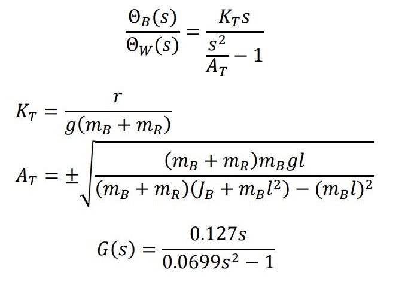
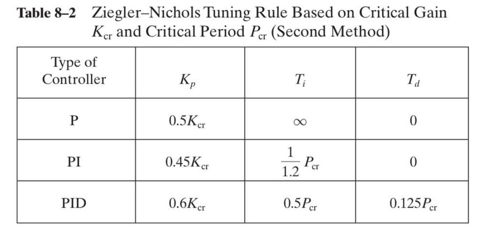

## Project Introduction:
The Self Balancing Robot is a two-wheeled robot capable of maintaining balance vertically on its two wheels and preventing falls. The control mechanism implemented in this robot provides resistance against impacts and external forces, enabling it to move on uneven and sloped surfaces.

<video width="320" height="240" controls>
  <source src="Data/SelfBalancingRobot.gif" type="video/gif">
  Your browser does not support the video tag.
</video>

To achieve balance, the robot’s center of mass and the center of its wheels must align along a hypothetical vertical line. In this project, the deviation of the robot from the vertical position is detected and calculated using an ultrasonic sensor. To compensate for this deviation, the wheels must rotate in the direction of the robot’s fall, and proportional, derivative, and integral control coefficients (PID controller) are experimentally determined to balance the robot based on its behavior in different control coefficients.

## Objective:
The mechanical behavior of a balancing robot is akin to an inverted pendulum on a moving cart, exhibiting inherent instability due to its nonlinearity. This project serves as a suitable platform for researching control algorithms and examining the effects of each controller coefficient. Additionally, two-wheeled robots, due to their physical characteristics, offer other advantages:

Two-wheeled robots require fewer components and occupy less space compared to robots with three or four wheels.
They have greater degrees of freedom and are highly practical in confined spaces.
Due to their lightweight and fewer components, they consume less energy and can serve as a good option in transportation systems.

## Components and Equipment Introduction:
The two-wheeled balancing robot has a simple mechanical structure. It consists of a pendulum that mimics the robot’s body, along with two wheels aligned on the lower part of the robot, each directly powered by an electric motor. The robot may have additional degrees of freedom, leading to a more complex mechanical section.
The main components of this robot include:

Plastic parts, screws, and nuts for the robot’s body (Chassis)
Two wheels
Two DC motors (actuators)
Driver for the motors
Two gearboxes to convert motor speed to torque
Ultrasonic sensor SR05 (sensor)
Arduino Uno board (electronic circuits)
Jumper wires (electronic circuits)
Breadboard (electronic circuits)

## Electronic Circuit:

The sensor has four wires, one of which is 5V internal, the other is ground, and the other two are trig and echo, which are connected to Arduino. One is labeled out and the other is in. By sending a pulse from out, we receive another pulse from the input, which determines the distance of the sensor to the ground, and in the initial stage, it was used to adjust the set point. The driver also has three wires, one connected to ground, and the other two are turned on and off in sequence to move the motors forward and backward and are connected to Arduino. The Schematic is drawn by "www.Tinkercad.com".

## Control System of the Project:
To examine the control system of this robot and design a controller for it, we first need to derive the dynamic equations of the system and mathematically model it.
The system can be divided into two parts: the main body and the rotational system on which the body is implemented. The rotational system includes the wheels, motors, driver, and gearbox. After obtaining the dynamic equations of the system, the physical parameters of the robot are incorporated into them. Based on the sources the final TF will be:

I used PID controller for controlling the system. So, I found the initial parameters based on Ziegler-Nichols tuning rule:

After increasing the Kp, I created an oscillation, then by giving an integral term, it can reach to an stability with overshoot but it still need long time reaching to steady state. Then by increasing the Derivative part, the overshoot decreases and it will be stable faster than PI controller. Tuning the system for the best parameters needs effort but finally gives you a pleasant result.

## Conclusion:
Setting the PID parameters in maintaining the balance of the robot plays a crucial role. These values can be defined according to the Ziegler-Nichols table, but due to simplifications that take place, they differ with empirical values. Based on all the obtained diagrams, the effect of each PID coefficient is as follows:

KpK_pKp​ is proportional to the system’s response speed, and increasing it makes the system respond quickly to any error.
KiK_iKi​, by looking at the past and summing up the errors that have occurred in the system, reduces the range of oscillations. However, increasing the value of this coefficient beyond a certain point leads to system instability due to very small oscillations, causing the system to move towards its inherent nature in a static state, which is inherently unstable.
KdK_dKd​, by looking into the future and the slope of the system at each moment, reduces overshoot and also increases resistance if the system experiences disturbance and impact.

## References 
- [1] F. R. Jiménez L., I. A. Ruge R., and A. F. Jiménez L., "Modeling and Control of a Two Wheeled AutoBalancing Robot: a didactic platform for control engineering education," Pedagogical and Technological University of Colombia - Department of Electronic Engineering - I2E Research Group.
- [2] P. Frankovský, L. Dominik, A. Gmiterko, I. Virgala, P. Kurylo, O. Perminova, "Modeling of Two-Wheeled Self-Balancing Robot Driven by DC Gearmotors," International Journal of Applied Mechanics and Engineering.
- [3] K. Ogata, "Modern Control Engineering," Pearson, 5th edition.

